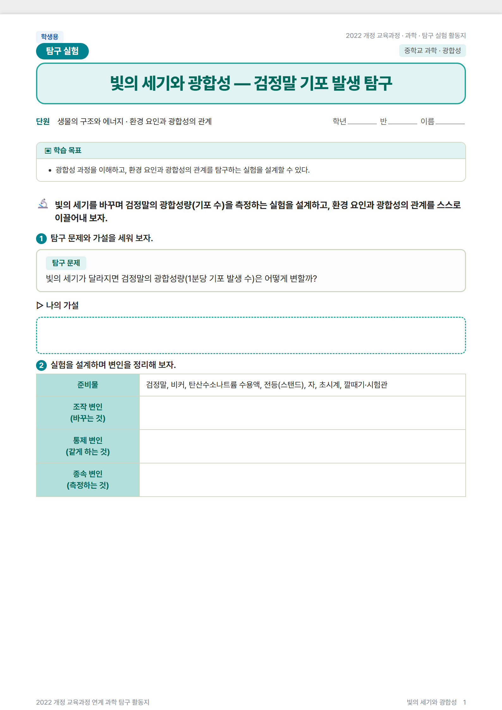
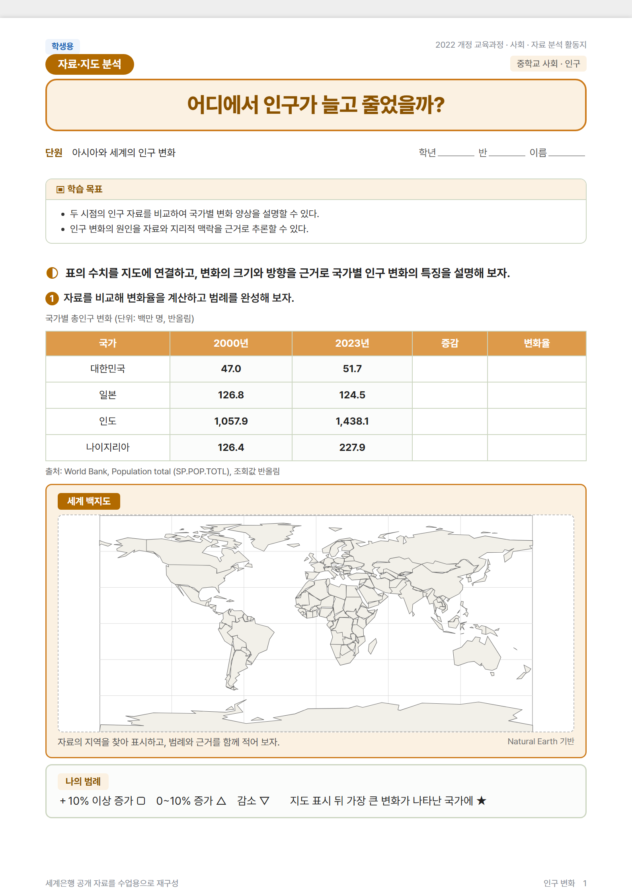
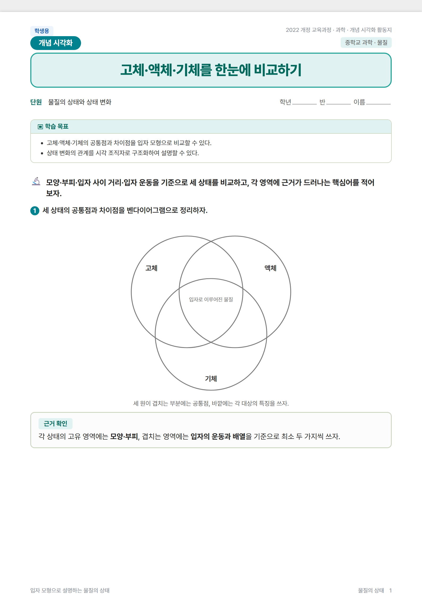

# worksheet-grab

[한국어](README.md) · [English](README.en.md)

worksheet-grab is a **local worksheet authoring, editing, and export tool for Korean primary and secondary teachers**. An AI harness such as Claude Code or Codex CLI interprets the teacher's request, while the Node CLI handles document structure, validation, and print output.

- The repository does not require a separate AI API key. Authentication or a subscription for your AI harness is separate.
- Built-in curriculum standards are looked up from source data rather than invented.
- Answers are physically removed from student copies. Student export stops if an answer leak is detected.
- HTML drafts can be created without Chrome. PDF and PNG export require Google Chrome.

> **Current status: Beta**
>
> The main generation, editing, validation, and export flows are implemented and covered by automated tests. Command interfaces and output formats may still change before a stable release. Review every worksheet before classroom distribution and keep the original files.

> This README explains the GitHub project and installation. In the teacher distribution bundle, `CLAUDE.md` and `AGENTS.md` are the actual entry points for AI harnesses.

## Clone the repository and create a teacher bundle

Opening the GitHub page alone does not provide the local engine, skills, or curriculum data required to run the workflow. Clone the repository, then create a teacher-facing folder with development files removed.

```bash
git clone https://github.com/pblsketch/worksheet-grab worksheet-grab
cd worksheet-grab
node scripts/build-user-bundle.mjs dist/worksheet-grab-user
cd dist/worksheet-grab-user
node bin/worksheet-grab.js help
```

The cloned repository root is a source-development workspace and includes tests, development documentation, and development-only AI configuration. Teachers should open only `dist/worksheet-grab-user` in an AI harness. That folder contains the runtime engine and teacher-facing skills. Developers who intend to modify the source can work from the repository root.

## Requirements

1. **One AI harness** — required for natural-language authoring; optional for direct CLI use
   - Claude Code
   - Codex CLI
   - Antigravity
2. **Node.js 24 or newer**
3. **Google Chrome** — only for PDF and PNG output
4. Git

Check your installation:

```bash
node --version
git --version
```

No `npm install` or build step is required.

## Three-minute start for teachers

### 1. Open the generated teacher folder in your AI harness

- Claude Code reads `CLAUDE.md` and `.claude/skills/`.
- Codex CLI and Antigravity use `AGENTS.md` as their entry point.

### 2. Ask in ordinary language

```text
Create a worksheet on photosynthesis for Korean middle-school grade 8 science.
```

To discuss the lesson before a draft is created:

```text
Let's design a photosynthesis worksheet together. Ask me questions first.
```

If subject, grade, or topic is missing, the harness asks only for the missing information. A complete request takes the direct generation path without forcing an interview.

## What can it produce?

- Separate **student and teacher worksheet versions**
- **HTML, PDF, and first-page PNG previews**
- Built-in themes for Korean language arts, science, social studies, and English
- **13 worksheet structures**, including inquiry, data interpretation, reading, discussion, concept mapping, projects, and writing
- **23 graphic organizers**, including KWL, Frayer models, 5W1H, Venn diagrams, concept maps, fishbones, and flowcharts
- A **browser editor** for questions, tables, images, response areas, answer marking, undo/redo, and automatic page reflow
- Document history and non-destructive restore
- Combined student and teacher workbooks made from multiple worksheets

The AI and teacher author the educational content. The engine assembles it within a constrained document and print model. A teacher should review content, difficulty, and suitability before distribution.

## Generated examples

These are not mockups. Each image is the first page of a student worksheet produced by the current beta engine through **curriculum lookup → worksheet assembly → student/teacher split → answer-leak validation → Chrome rendering**. The science inquiry continues for three pages; the social data-analysis and graphic-organizer worksheets each continue for two pages.

| Science inquiry · Photosynthesis (3 pages) | Social data analysis · Population change (2 pages) |
|---|---|
|  |  |

- Science: inquiry question → hypothesis → variable design → data table and graph → interpretation
- Social studies: real world map and public population data → rate calculation → map legend → causal fishbone

### Graphic organizer · States of matter (2 pages)



The three-circle Venn diagram on page one is followed by a six-node concept map and a four-step flowchart on page two. The engine owns shape geometry and coordinates; the teacher or AI harness supplies topic labels and activity instructions.

## AI harness status

| Environment | Entry point | Current verification scope |
|---|---|---|
| Claude Code | `CLAUDE.md` + `.claude/skills/` | Native project harness |
| Codex CLI | `AGENTS.md` + bundled skills | Recorded smoke test for consultation routing and generation |
| Antigravity | `AGENTS.md` + bundled skills | Same portability contract; environment-specific smoke procedure provided |

In Codex and Antigravity, Claude-specific team instructions are translated into a single agent performing the same stages sequentially. See [`docs/CROSS-PROVIDER-SMOKE.md`](docs/CROSS-PROVIDER-SMOKE.md) for the verification procedure and current record.

## Direct CLI use

The deterministic generation, validation, editing, and export commands can also be run directly.

### Generate in one command

```bash
# Standards lookup → assembly → student/teacher copies → validation → PDF
node bin/worksheet-grab.js pipeline 중2과학 광합성 --out out/

# Stop at HTML drafts; Chrome is not required
node bin/worksheet-grab.js pipeline 중2사회 인구 --out out/ --no-render

# Include a first-page PNG preview
node bin/worksheet-grab.js generate 중2영어 감정 --out out/ --png
```

The built-in curriculum dataset and subject tokens currently use Korean labels, so the direct CLI examples retain Korean arguments even when the AI conversation is in English.

### Save a document and edit it in the browser

```bash
node bin/worksheet-grab.js generate 중2과학 광합성 --doc 광합성탐구
node bin/worksheet-grab.js edit-ui 광합성탐구
node bin/worksheet-grab.js doc export 광합성탐구
```

`edit-ui` is served only on a local address. Every save revalidates the document structure and answer-leak rules and adds a history snapshot.

### Revise an existing draft

```bash
node bin/worksheet-grab.js edit out/science-광합성.manifest.json \
  "3번 문항 빼고 성찰 추가" --out out/
```

By default, revisions preserve the original and create `-v2`, `-v3`, and later versions. The original is overwritten only when `--in-place` is explicitly supplied.

### Discover all commands

```bash
node bin/worksheet-grab.js help
node bin/worksheet-grab.js list-archetypes
node bin/worksheet-grab.js list-vocab
```

## Curriculum standards and subject scope

- Built-in CSV: `data/achievement-standards.csv`
- Alternative CSV: `--csv <path>` or `GEPAI_CSV`
- Curriculum standards are read-only source data.
- Student-facing worksheets show accessible **learning objectives** by default.
- Use `--show-standards` to include the supporting standards in the teacher copy.

The current subject-specific themes and bindings focus on Korean language arts, science, social studies, and English. Cross-curricular structures and organizers can be reused elsewhere, but teachers should adapt and review them for the target subject.

## Answer and privacy safeguards

- Answer objects are removed at the document-tree level from student copies.
- If a leak is detected, student HTML and PDF export stops while the teacher copy is retained.
- The default CSV and local CLI path do not send student data to an external server.
- Content entered into an AI harness or optional MCP may be processed under that provider's policy. Do not enter student names or sensitive personal information.

## Current boundaries

- This is not a hosted web service or a standalone desktop app. It is a **local CLI + AI harness + browser editor** workflow.
- Real PDF and PNG print rendering requires Chrome.
- Teacher review remains necessary for factual accuracy, instructional level, and copyright suitability of AI-authored content.
- The Antigravity entry contract is included, but each installation should run the supplied smoke procedure.

## Development and verification

```bash
npm run test:unit
npm run test:render
node scripts/build-user-bundle.mjs dist/worksheet-grab-user
```

- `npm run test:unit`: engine and document-contract tests that do not require Chrome
- `npm run test:render`: print and editor parity tests using a real Chrome instance
- User bundle: includes the engine and teacher harness while excluding tests and development documentation

See [`docs/HARNESS-MAP.md`](docs/HARNESS-MAP.md) for harness boundaries and [`docs/CROSS-PROVIDER-SMOKE.md`](docs/CROSS-PROVIDER-SMOKE.md) for cross-provider verification.

## License and inspiration

MIT License.

worksheet-grab was inspired by the plan → design → edit → export workflow and no-API philosophy of [slides-grab](https://github.com/NomaDamas/slides-grab). Worksheets are printable multi-page reflow documents rather than fixed slides, so this project uses an independent implementation rather than a code fork.
